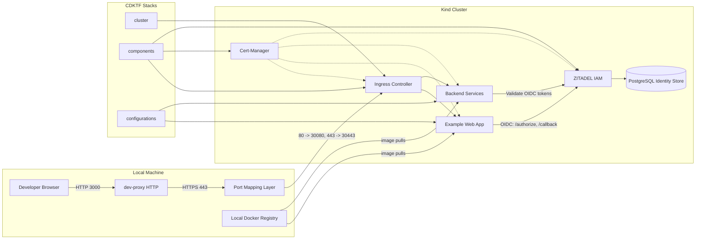

# seemueller-io/cluster

### k8s _"as simple as possible, but no simpler."_

```shell
<npm|yarn|pnpm|bun> run clean
<npm|yarn|pnpm|bun> run setup
<npm|yarn|pnpm|bun> run dev
```

## Directory Structure
```markdown
deploy/
├── [env]: Environment Deployment
│ ├── cluster - Manages deployment of a cluster
│ ├── components - Manages deployments of services on the cluster (ZITADEL, CertManager, ect...)
│ └── configurations - Manages provider specific configurations
packages/
└── Scripts, Example Apps, and a development proxy
```


## Architecture



The dev-proxy accepts HTTP on port 3000 and forwards HTTPS to the ingress controller inside the Kind cluster. Traffic is routed through ingress to services secured by ZITADEL and PostgreSQL, with Cert-Manager handling TLS. CDKTF provisions the cluster, core components, and app configs.

## Developer Notes
For platforms other than Darwin, you'll need to trust root certificates manually.
